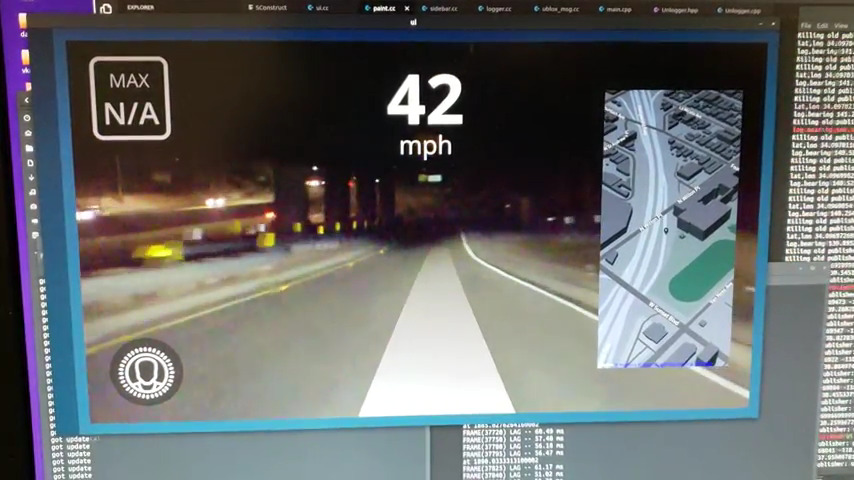
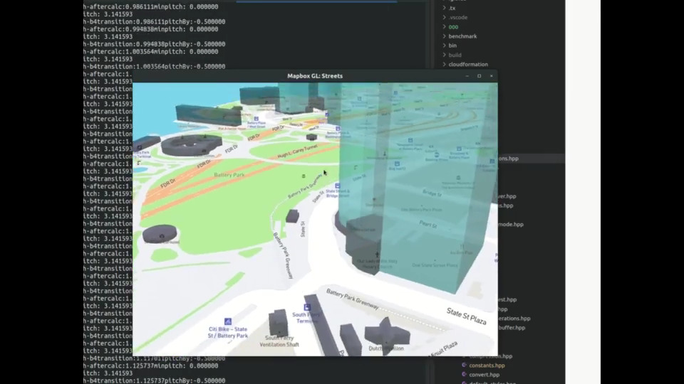
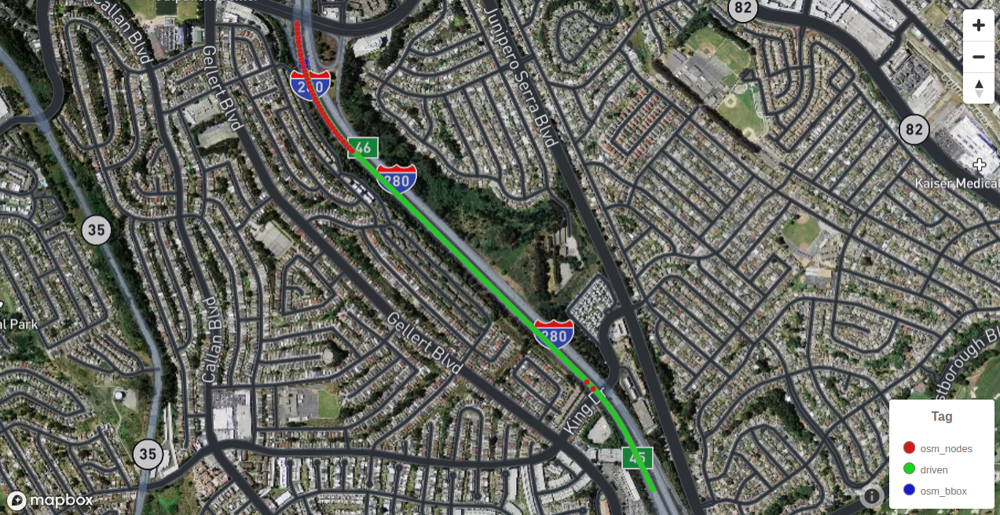
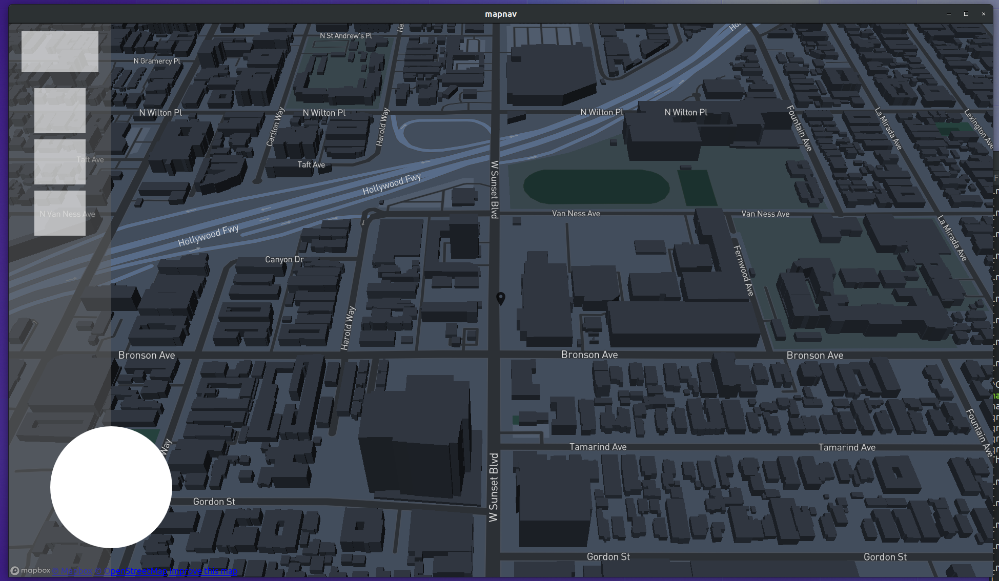
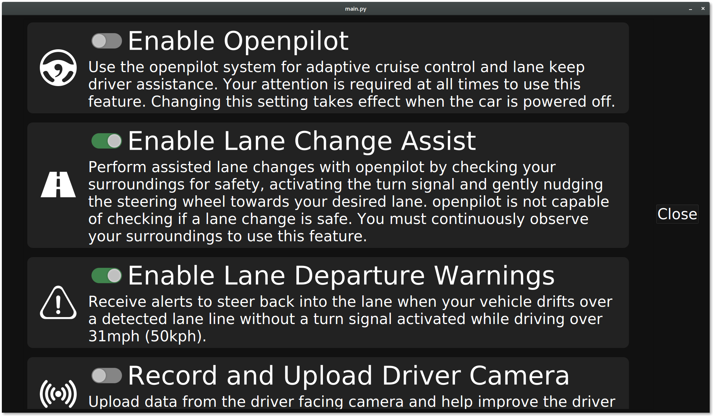
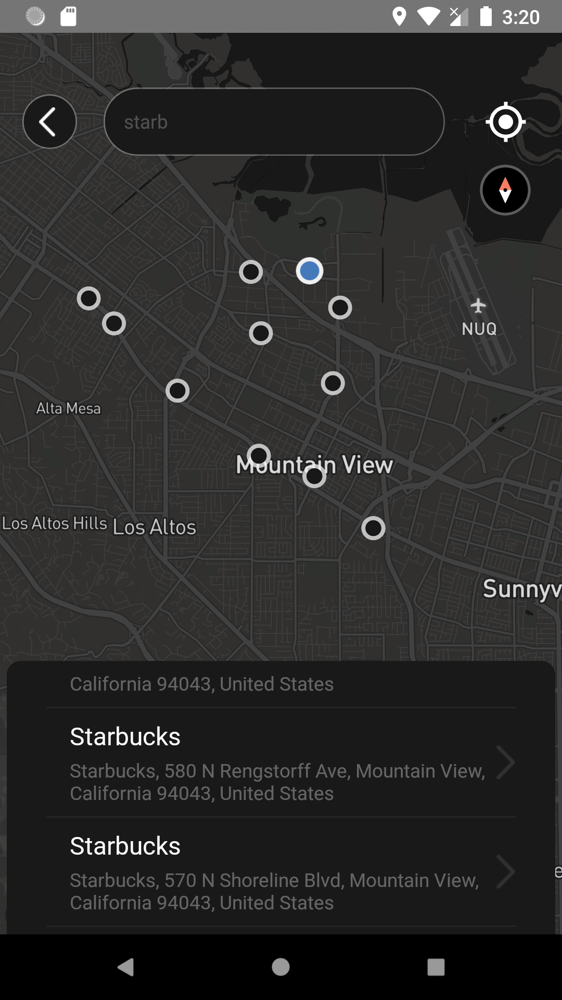

### Notes and findings on maps/nav for openpilot

#### Rendering:
- Probably won't need texture IPC if we can just run everything from the new QT UI (except for UI crashes, which hopefully it shouldn't) ~~Adreno 530 driver on current EON/C2 Android version doesn't seem to support "EXT_external_objects_fd" OpenGL/Vulkan extensions used for IPC GL texture. Could fallback to some shared DMA/ION/SVM like vision does? (maybe benchmark both solutions to check if there are real perf gains) Or even draw directly from UI module? (related discord link: https://discordapp.com/channels/469524606043160576/534138605136773138/730596253720641556)
(OnePlus3 vulkan driver info https://vulkan.gpuinfo.org/displayreport.php?id=3603#extensions)~~

*(link on the image for video)*

- Current mapbox-gl-native breaks down when trying to pitch camera below 60 degrees ([mapbox-gl-js now has sorta fixed this on version 2.0.0](https://github.com/mapbox/mapbox-gl-js/blob/main/CHANGELOG.md#-features-and-improvements), max pitch is now 85degrees, still would require pitch>90deg for AR overlays). Also causes maptile requests runaway. Could fix with LODs. Need to investigate other implementations fixes (JS and iOS). This is mainly useful if nav would do AR projections over camera frames.  (related discord link: https://discordapp.com/channels/469524606043160576/534138605136773138/740115817924132884)

*(link on the image for video)*

- Current mapbox implementations doesn't seem to support multi-lane rendering, if needed for map visualization then need to implement support for it.

##### Links dump:
- Mabpox Lanes:
	- https://docs.mapbox.com/api/navigation/#lane-object
- OSM Lanes:
	- https://wiki.openstreetmap.org/wiki/Lanes
	- https://wiki.openstreetmap.org/wiki/Key:lanes

- mapbox-gl-native pitch limitation related issues on github:
    - https://github.com/mapbox/mapbox-gl-native/pull/15195
    - https://github.com/mapbox/mapbox-gl-native/issues/15163
    - https://github.com/mapbox/mapbox-gl-native/pull/15230
    - https://github.com/mapbox/mapbox-gl-native/issues/9037
    - https://github.com/mapbox/mapbox-gl-native/issues/6908
    - https://github.com/mapbox/mapbox-gl-native/issues/2190
    - https://github.com/mapbox/mapbox-gl-js/pull/8975
    - https://github.com/mapbox/mapbox-gl-native-android/issues/162

#### Nav:
- Could use overpass to query OSM ways/segments nodes and extract lane info
https://github.com/marschr/comma2k19 (check notebooks/plot_on_map.ipynb )

- As for routing, OSM does provide the number of lanes for a given path/way segment and some turn lane restrictions. Mapbox does provide turn lane restrictions and routing APIs. Will openpilot need multi-lane info to navigate on crowded highways (to feed the model/cereal desire inputs) or just "keep right/left" would be enough? Also, C2 GPS positioning with KF seems good enough to localize ego position within lanes.

#### Todo: 
- [paused] Implement overpass + OSM data local server:
    - Links
        - https://wiki.openstreetmap.org/wiki/Setting_up_a_local_copy_of_the_OpenStreetMap_database,_kept_up_to_date_with_minutely_diffs
        - http://overpass-api.de/
        - http://overpass-api.de/no_frills.html
        - http://overpass-api.de/full_installation.html
        - https://github.com/drolbr/Overpass-API
        - https://wiki.openstreetmap.org/wiki/Overpass_turbo
        - https://switch2osm.org/serving-tiles/manually-building-a-tile-server-16-04-2-lts/
        - https://gist.github.com/amolkhanorkar/8706915
- [paused] Prototype frontend with nav/routing controls on QT

- [done] ~~PyQt5 offroad port for faster styling and prototyping (port back to C++ for production)~~ easier to do cpp right away.
     
    
- Cleanup local codebase and openpilot fork and push to github.
- [done]Hack comma connect to send routes to openpilot
    
    *(link on the image for video)*
    - Lots of old/deprecated dependencies on the react-native side of things, hard to get stable builds. ~~Should~~ must update! ~~Dockerize with old build tools? Bit of both for future CI?~~ CI needed.
    - ~~offroad apks seems to use Android dev tools v23 and v27 (but~~ hey, qt5)
    - [done] Hardcoded mocked paired comma device/car in connect app works. Gives better android emulator and react native tooling integration when developing. Also, hot realoading app changes now works. (still would need proper device mocking for CI).
    - [work in progress] Add address search fields and make it query valhalla.
    - ~~should use athena?~~ Using athena alike service to communicate op with app, could easily port to athena.
    - Naming things is hard... navigation? app screens navigation? directions? driving directions?
- [work in progress]Check/implement Valhalla stuff:
    - [done] Setup OSM data + Valhalla service (docker probl'y), need testing on mobile hardware.
    - Which valhalla modules one would minimally need to run it on the device for querying local storage cached map data? Which modules would need to run (and potentially scalling) the server side.
    - ~~What's a good map query and sync architecture/abstraction for both react-native app + QT5.~~
    - What would take to initially mimic the waze experience? And what could easily be better?
    - https://github.com/valhalla/valhalla
    - https://wiki.openstreetmap.org/wiki/Valhalla
    - https://github.com/valhalla/docker
    - https://www.interline.io/valhalla/
    - https://github.com/valhalla/valhalla/blob/master/docs/api/turn-by-turn/api-reference.md
    - Nice Valhalla overview: https://www.youtube.com/watch?v=jYRimQ3LwOw
    - THIS!! The diagram and the whole page gives a great overview of the pipeline: https://github.com/valhalla/valhalla/blob/master/docs/route_overview.md
    - Response format:
        - http://project-osrm.org/docs/v5.5.1/api/#introduction
        - https://github.com/Project-OSRM/osrm-backend
        - https://github.com/valhalla/valhalla-docs/blob/master/turn-by-turn/api-reference.md#outputs-of-a-route
    - Geocoding: 
        - https://github.com/mapbox/carmen/blob/master/docs/how-carmen-works.md
        - https://github.com/komoot/photon (meh, java)
        - https://github.com/pelias/api

#### Mapping stuff:
- Mapbox vector tiles protobuf spec definitions:
    - https://github.com/mapbox/vector-tile-spec/blob/master/2.1/vector_tile.proto
    - https://github.com/mapbox/vector-tile-spec/blob/master/2.1/README.md
    - related: https://wiki.openstreetmap.org/wiki/PBF_Format
- https://openlayers.org/en/latest/examples/osm-vector-tiles.html
- https://github.com/geovation/tiler

##### Other links/stuff:
- https://www.mapzen.com/
- https://github.com/mapzen/
- https://www.interline.io/osm/extracts/
- https://doc.qt.io/qt-5/location-plugin-mapboxgl.html
- http://gtfs.org/
- http://gtfs.org/reference/realtime/v2/
- Maybe alternative renderer using OGLES https://github.com/tangrams/tangram-es